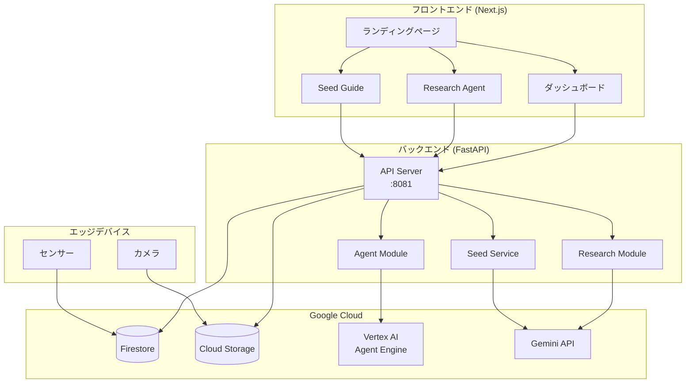
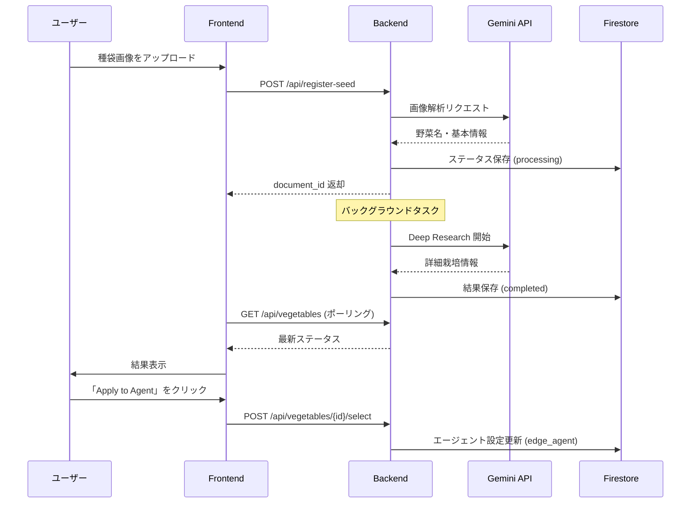
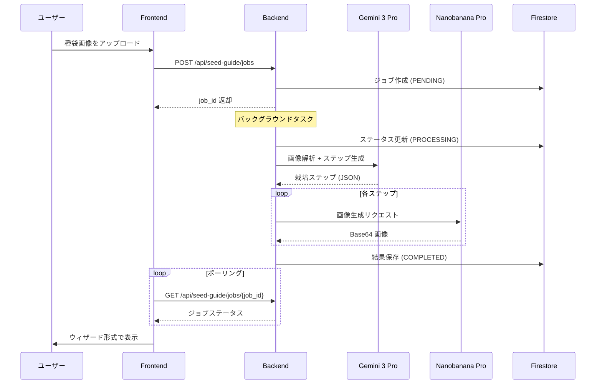

# 🌱 AI Batake App

AIを活用したスマート農業プラットフォームです。センサーデータのリアルタイム監視、種袋画像からの栽培情報の自動抽出、およびAIエージェントによる栽培ガイドの生成を行います。

## 📋 概要

AI Batake Appは、家庭菜園や農業を支援するためのAIプラットフォームです。以下の機能を提供します：

- **リアルタイム環境監視**: 温度、湿度、土壌水分などのセンサーデータをリアルタイムで可視化
- **種袋画像解析**: AIによる種袋画像の自動分析と栽培情報の抽出
- **Deep Research**: Gemini AIを活用した詳細な栽培条件の調査
- **栽培ガイド生成**: ステップバイステップの栽培手順と画像の自動生成

## 🛠️ 技術スタック

### バックエンド
| 技術 | バージョン | 用途 |
|------|----------|------|
| Python | 3.11 | メイン言語 |
| FastAPI | - | Web API フレームワーク |
| Uvicorn | - | ASGI サーバー |
| Google Cloud Firestore | - | NoSQL データベース |
| Google Cloud Storage | - | 画像ストレージ |
| Google Vertex AI | - | AI エージェント基盤 |
| Gemini API | - | 画像解析・Deep Research |

### フロントエンド
| 技術 | バージョン | 用途 |
|------|----------|------|
| Next.js | 16 | React フレームワーク (App Router) |
| React | 19 | UI ライブラリ |
| TypeScript | 5 | 型安全な開発 |
| Tailwind CSS | 4 | スタイリング |
| Radix UI | - | アクセシブルな UI コンポーネント |
| Recharts | - | データ可視化 |

### インフラ
| 技術 | 用途 |
|------|------|
| Docker | コンテナ化 |
| Google Cloud Run | サーバーレスデプロイ |

## 📁 ディレクトリ構成

```
ai-batake-app/
├── backend/                    # Python FastAPI バックエンド
│   ├── main.py                # メインアプリケーション・APIエンドポイント
│   ├── agent.py               # Vertex AI エージェント連携
│   ├── db.py                  # Firestore データベース操作
│   ├── research_agent.py      # 種袋解析・Deep Research
│   ├── seed_service.py        # 非同期栽培ガイド生成
│   ├── requirements.txt       # Python 依存関係
│   └── tests/                 # テストファイル
│
├── frontend/                   # Next.js フロントエンド
│   ├── app/                   # App Router ページ
│   │   ├── page.tsx          # ランディングページ
│   │   ├── dashboard/        # ダッシュボード
│   │   ├── research_agent/   # Research Agent UI
│   │   └── seed_guide/       # 栽培ガイド生成 UI
│   ├── components/            # React コンポーネント
│   │   ├── ui/               # 基本 UI コンポーネント
│   │   ├── metric-card.tsx   # センサーメトリクス表示
│   │   ├── weather-card.tsx  # 天気情報表示
│   │   └── ...
│   └── lib/                   # ユーティリティ関数
│
├── docs/                       # ドキュメント
├── Dockerfile                  # Docker ビルド設定
├── start.sh                    # 起動スクリプト
└── README.md                   # このファイル
```

## 🚀 セットアップ

### 前提条件

- Node.js 18以上
- Python 3.11
- Google Cloud アカウント（Firestore, Storage, Vertex AI の有効化）

### 環境変数

以下の環境変数を設定してください：

```bash
# Google Cloud
export GOOGLE_CLOUD_PROJECT="your-project-id"
export GOOGLE_APPLICATION_CREDENTIALS="/path/to/service-account.json"

# AI Agent
export AGENT_ENDPOINT="projects/{PROJECT_ID}/locations/us-central1/reasoningEngines/{AGENT_ID}"

# Gemini API (Optional)
export GEMINI_API_KEY="your-api-key"
export SEED_GUIDE_GEMINI_KEY="your-api-key"
```

### ローカル開発

#### バックエンド
```bash
cd backend
pip install -r requirements.txt
uvicorn backend.main:app --host 0.0.0.0 --port 8081 --reload
```

#### フロントエンド
```bash
cd frontend
npm install --legacy-peer-deps
npm run dev
```

### Docker ビルド
```bash
# イメージのビルド
docker build -t ai-batake-app .

# コンテナの実行
docker run -p 8080:8080 -p 8081:8081 ai-batake-app
```

## 📊 アーキテクチャ

### システム全体図



### 種袋解析フロー



### 栽培ガイド生成フロー (非同期ジョブ)



## 🧪 テスト

### バックエンド
```bash
cd backend
pip install pytest pytest-asyncio httpx
pytest
```

### フロントエンド
```bash
cd frontend
npm test
```

詳細なテスト情報については [docs/TEST_README.md](docs/TEST_README.md) を参照してください。

## 📱 画面構成

| 画面 | パス | 説明 |
|------|-----|------|
| ランディング | `/` | アプリ概要と各機能へのナビゲーション |
| ダッシュボード | `/dashboard` | センサーデータ・天気・成長段階の表示 |
| Research Agent | `/research_agent` | 種袋解析と詳細リサーチ |
| Seed Guide | `/seed_guide` | 非同期栽培ガイド生成 |

## 🔗 API エンドポイント

| メソッド | エンドポイント | 説明 |
|---------|---------------|------|
| POST | `/api/weather` | 天気情報取得 |
| GET | `/api/sensors/latest` | 最新センサーデータ取得 |
| GET | `/api/sensor-history` | センサー履歴取得 |
| GET | `/api/vegetables/latest` | 最新野菜データ取得 |
| GET | `/api/vegetables` | 全野菜リスト取得 |
| POST | `/api/vegetables/{doc_id}/select` | 育成情報の選択・エージェント適用 |
| POST | `/api/register-seed` | 種袋登録・解析開始 |
| GET | `/api/plant-camera/latest` | 最新植物画像取得 |
| POST | `/api/seed-guide/jobs` | 栽培ガイドジョブ作成 |
| GET | `/api/seed-guide/jobs/{job_id}` | ジョブステータス取得 |

## 📄 ライセンス

© 2025 Smart Farm AI Team

## 🤝 コントリビューション

1. このリポジトリをフォーク
2. フィーチャーブランチを作成 (`git checkout -b feature/amazing-feature`)
3. 変更をコミット (`git commit -m 'Add amazing feature'`)
4. ブランチにプッシュ (`git push origin feature/amazing-feature`)
5. プルリクエストを作成
