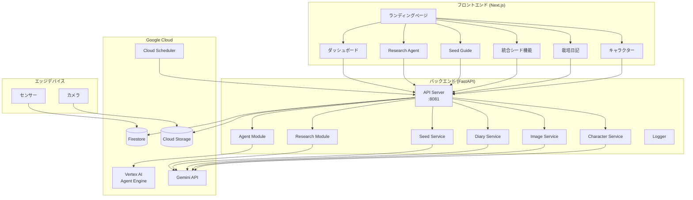
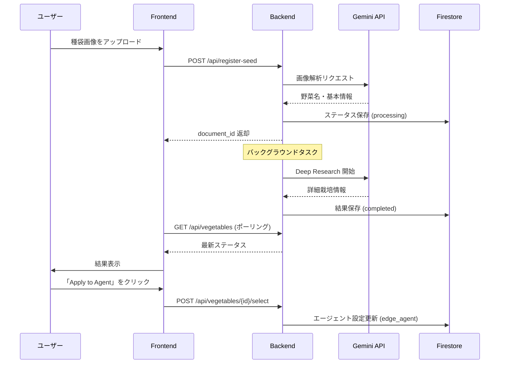
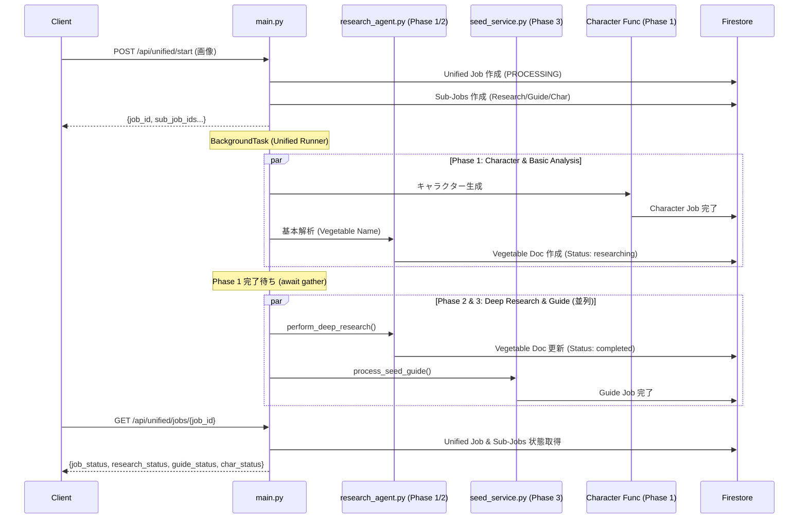
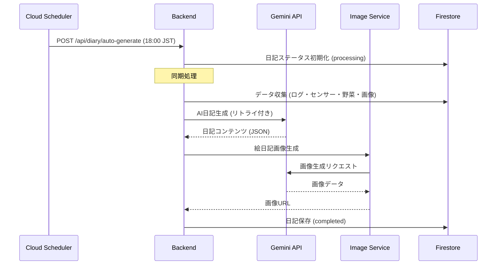

# 🌱 AI Batake App

AIを活用したスマート農業プラットフォームです。センサーデータのリアルタイム監視、種袋画像からの栽培情報の自動抽出、およびAIエージェントによる栽培ガイドの生成を行います。

## 📋 概要

AI Batake Appは、家庭菜園や農業を支援するためのAIプラットフォームです。以下の機能を提供します：

- **リアルタイム環境監視**: 温度、湿度、土壌水分などのセンサーデータをリアルタイムで可視化
- **種袋画像解析**: AIによる種袋画像の自動分析と栽培情報の抽出
- **Deep Research**: Gemini AIを活用した詳細な栽培条件の調査
- **栽培ガイド生成**: ステップバイステップの栽培手順と画像の自動生成
- **AIキャラクター作成**: 種袋画像からオリジナルの野菜キャラクターを生成
- **統合シード機能**: 種袋解析・Deep Research・栽培ガイド・キャラクター生成をワンクリックで実行
- **AIアクティビティログ**: エージェントの自律動作内容をタイムラインで表示
- **自動栽培日記生成**: 毎日のセンサーデータと天気情報から栽培日記を自動生成 (by Cloud Scheduler)
- **絵日記画像生成**: AI生成キャラクターを含む絵日記風画像の自動生成

## 🛠️ 技術スタック

### バックエンド
| 技術 | バージョン | 用途 |
|------|----------|------|
| Python | 3.11 | メイン言語 |
| FastAPI | - | Web API フレームワーク |
| Uvicorn | - | ASGI サーバー |
| Google Cloud Firestore | - | NoSQL データベース |
| Google Cloud Storage | - | 画像ストレージ |
| Google Vertex AI | - | AI エージェント基盤 |
| Gemini API | - | 画像解析・Deep Research・日記/画像生成 |
| Google Cloud Scheduler | - | 定期実行ジョブ (日記生成) |

### フロントエンド
| 技術 | バージョン | 用途 |
|------|----------|------|
| Next.js | 16 | React フレームワーク (App Router) |
| React | 19 | UI ライブラリ |
| TypeScript | 5 | 型安全な開発 |
| Tailwind CSS | 4 | スタイリング |
| Radix UI | - | アクセシブルな UI コンポーネント |
| Recharts | - | データ可視化 |

### インフラ
| 技術 | 用途 |
|------|------|
| Docker | コンテナ化 |
| Google Cloud Run | サーバーレスデプロイ |
| Google Cloud Scheduler | 定期実行ジョブ |

## 📁 ディレクトリ構成

```
ai-batake-app/
├── backend/                    # Python FastAPI バックエンド
│   ├── main.py                # メインアプリケーション・APIエンドポイント
│   ├── agent.py               # Vertex AI エージェント連携
│   ├── db.py                  # Firestore データベース操作
│   ├── research_agent.py      # 種袋解析・Deep Research
│   ├── seed_service.py        # 非同期栽培ガイド生成
│   ├── diary_service.py       # 自動栽培日記生成サービス
│   ├── image_service.py       # 絵日記画像生成サービス
│   ├── character_service.py   # AIキャラクター生成サービス
│   ├── logger.py              # 構造化ロギング
│   ├── requirements.txt       # Python 依存関係
│   └── tests/                 # テストファイル (473テスト)
│
├── frontend/                   # Next.js フロントエンド
│   ├── app/                   # App Router ページ
│   │   ├── page.tsx          # ランディングページ
│   │   ├── dashboard/        # ダッシュボード
│   │   ├── research_agent/   # Research Agent UI
│   │   ├── seed_guide/       # 栽培ガイド生成 UI
│   │   ├── unified/          # 統合シード機能 UI
│   │   ├── diary/            # 栽培日記表示
│   │   └── character/        # キャラクター管理
│   ├── components/            # React コンポーネント
│   │   ├── ui/               # 基本 UI コンポーネント
│   │   ├── metric-card.tsx   # センサーメトリクス表示
│   │   ├── weather-card.tsx  # 天気情報表示
│   │   ├── ai-activity-log.tsx # AIアクティビティログ
│   │   └── ...
│   └── lib/                   # ユーティリティ関数
│
├── docs/                       # ドキュメント
├── Dockerfile                  # Docker ビルド設定
├── start.sh                    # 起動スクリプト
└── README.md                   # このファイル
```

## 🚀 セットアップ

### 前提条件

- Node.js 18以上
- Python 3.11
- Google Cloud アカウント（Firestore, Storage, Vertex AI の有効化）

### 環境変数

以下の環境変数を設定してください：

```bash
# Google Cloud
export GOOGLE_CLOUD_PROJECT="your-project-id"
export GOOGLE_APPLICATION_CREDENTIALS="/path/to/service-account.json"

# AI Agent
export AGENT_ENDPOINT="projects/{PROJECT_ID}/locations/us-central1/reasoningEngines/{AGENT_ID}"

# Gemini API (Optional)
export GEMINI_API_KEY="your-api-key"
export SEED_GUIDE_GEMINI_KEY="your-api-key"

# Diary Auto Generation (Optional)
export DIARY_API_KEY="your-secret-key-for-scheduler"
```

### ローカル開発

#### バックエンド
```bash
cd backend
pip install -r requirements.txt
uvicorn backend.main:app --host 0.0.0.0 --port 8081 --reload
```

#### フロントエンド
```bash
cd frontend
npm install --legacy-peer-deps
npm run dev
```

### Docker ビルド
```bash
# イメージのビルド
docker build -t ai-batake-app .

# コンテナの実行
docker run -p 8080:8080 -p 8081:8081 ai-batake-app
```

## 📊 アーキテクチャ

### システム全体図



### 種袋解析フロー



### 統合シード機能フロー (POST /api/unified/start)



### 栽培日記自動生成フロー



## 🧪 テスト

### バックエンド
```bash
cd backend
pip install pytest pytest-asyncio httpx
pytest
```

### フロントエンド
```bash
cd frontend
npm test
```

詳細なテスト情報については [docs/TEST_README.md](docs/TEST_README.md) を参照してください。

## 📱 画面構成

| 画面 | パス | 説明 |
|------|-----|------|
| ランディング | `/` | アプリ概要と各機能へのナビゲーション |
| ダッシュボード | `/dashboard` | センサーデータ・天気・成長段階の表示 |
| Research Agent | `/research_agent` | 種袋解析と詳細リサーチ |
| Seed Guide | `/seed_guide` | 非同期栽培ガイド生成 |
| 統合シード機能 | `/unified` | Research・Guide・Character のワンクリック統合実行 |
| 栽培日記 | `/diary` | 自動生成された栽培日記の閲覧 |
| キャラクター | `/character` | AI生成キャラクターの管理 |

## 🔗 API エンドポイント

### センサー・天気
| メソッド | エンドポイント | 説明 |
|---------|---------------|------|
| POST | `/api/weather` | 天気情報取得 |
| GET | `/api/sensors/latest` | 最新センサーデータ取得 |
| GET | `/api/sensor-history` | センサー履歴取得 |

### 野菜・種袋
| メソッド | エンドポイント | 説明 |
|---------|---------------|------|
| GET | `/api/vegetables/latest` | 最新野菜データ取得 |
| GET | `/api/vegetables` | 全野菜リスト取得 |
| POST | `/api/vegetables/{doc_id}/select` | 育成情報の選択・エージェント適用 |
| DELETE | `/api/vegetables/{doc_id}` | 野菜データ削除 |
| POST | `/api/register-seed` | 種袋登録・解析開始 |
| GET | `/api/plant-camera/latest` | 最新植物画像取得 |
| GET | `/api/agent-logs` | エージェント実行ログ取得 |
| GET | `/api/agent-logs/oldest` | 最古のエージェントログ (播種日数計算用) |

### 栽培ガイド
| メソッド | エンドポイント | 説明 |
|---------|---------------|------|
| POST | `/api/seed-guide/jobs` | 栽培ガイドジョブ作成 |
| GET | `/api/seed-guide/jobs/{job_id}` | ジョブステータス取得 |
| POST | `/api/seed-guide/save` | 栽培ガイド保存 |
| GET | `/api/seed-guide/saved` | 保存済みガイド一覧 |
| GET | `/api/seed-guide/saved/{doc_id}` | 保存済みガイド取得 |
| DELETE | `/api/seed-guide/saved/{doc_id}` | 保存済みガイド削除 |
| GET | `/api/seed-guide/image/{job_id}/{step_index}` | ガイド画像プロキシ |

### キャラクター
| メソッド | エンドポイント | 説明 |
|---------|---------------|------|
| POST | `/api/seed-guide/character` | キャラクター生成ジョブ作成 |
| GET | `/api/seed-guide/character/{job_id}` | キャラクタージョブステータス |
| GET | `/api/characters` | キャラクター一覧 |
| POST | `/api/characters/{job_id}/select` | キャラクター選択 |
| GET | `/api/character` | 最新キャラクター情報取得 |
| GET | `/api/character/image` | キャラクター画像取得 (プロキシ) |

### 統合シード機能
| メソッド | エンドポイント | 説明 |
|---------|---------------|------|
| POST | `/api/unified/start` | 統合ジョブ開始 (Research + Guide + Character) |
| GET | `/api/unified/jobs/{job_id}` | 統合ジョブステータス取得 |

### 栽培日記
| メソッド | エンドポイント | 説明 |
|---------|---------------|------|
| POST | `/api/diary/auto-generate` | 栽培日記自動生成 (Scheduler用) |
| POST | `/api/diary/generate-manual` | 栽培日記手動生成 (SSE) |
| POST | `/api/diary/generate-daily` | 日次日記生成 |
| GET | `/api/diary/list` | 栽培日記一覧取得 |
| GET | `/api/diary/{date}` | 指定日の日記取得 |
| GET | `/api/diary/{date}/image` | 日記絵日記画像取得 (プロキシ) |

## 📄 ライセンス

© 2026 チーム笑顔隊

## 🤝 コントリビューション

1. このリポジトリをフォーク
2. フィーチャーブランチを作成 (`git checkout -b feature/amazing-feature`)
3. 変更をコミット (`git commit -m 'Add amazing feature'`)
4. ブランチにプッシュ (`git push origin feature/amazing-feature`)
5. プルリクエストを作成
