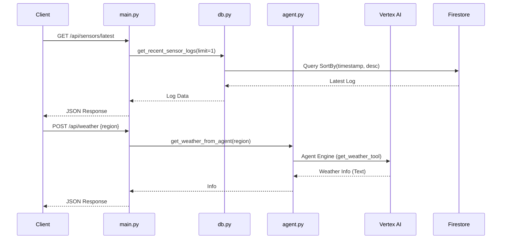
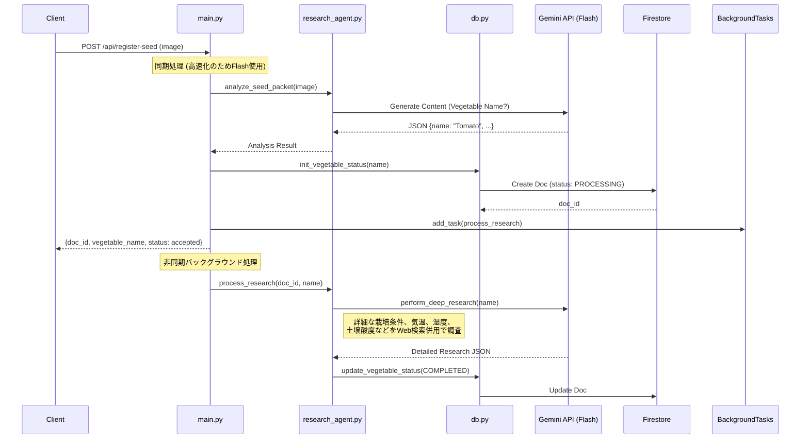
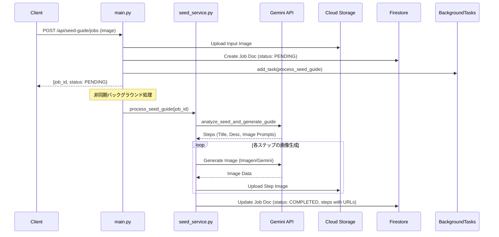
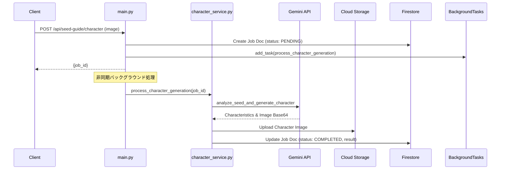
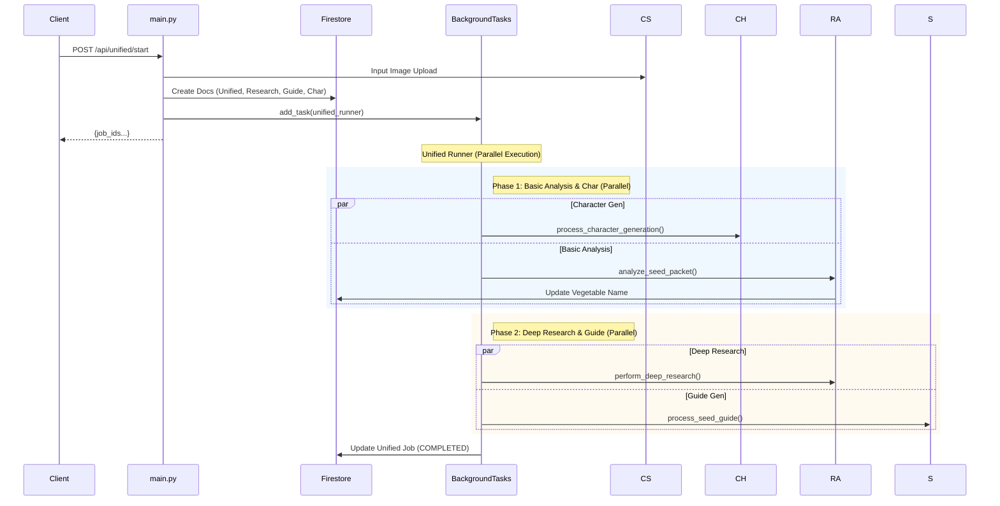
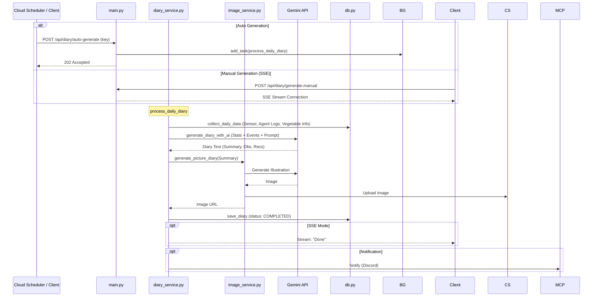

# 🌱 AI Batake App - Backend

FastAPIで構築されたAI Batake Appのバックエンドサーバーです。センサーデータの管理、AI連携、栽培ガイド生成などの機能を提供します。

## 📋 概要

このバックエンドは以下の機能を提供します：

- **センサーデータ管理**: Firestoreからのセンサーデータ取得・履歴管理
- **天気エージェント連携**: Vertex AI Agent Engineを通じた天気情報取得
- **種袋解析**: Gemini APIを使用した種袋画像の解析
- **Deep Research**: AIによる詳細な栽培条件の調査
- **栽培ガイド生成**: 非同期ジョブによるステップバイステップガイドの生成
- **キャラクター生成**: 種袋画像からの野菜AIキャラクター生成
- **栽培日記自動生成**: Cloud Scheduler連携による毎日の栽培日記の自動生成
- **絵日記画像生成**: AIキャラクターを含む絵日記風画像の生成
- **統合シード機能**: Research・Guide・Character の並列実行
- **アクティブ野菜設定**: エッジエージェント設定（`configurations/edge_agent`）に基づく日記生成（過去の野菜を選択した場合でもその野菜名を優先）

## 🛠️ 技術スタック

| 技術 | バージョン | 用途 |
|------|----------|------|
| Python | 3.11 | メイン言語 |
| FastAPI | - | Web API フレームワーク |
| Uvicorn | - | ASGI サーバー |
| Google Cloud Firestore | - | NoSQL データベース |
| Google Cloud Storage | - | 画像ストレージ |
| Google Vertex AI | - | AI エージェント基盤 |
| Gemini API | - | 画像解析・Deep Research・日記/画像生成 |
| pytest | 7.4+ | テストフレームワーク |

## 📁 ファイル構成

```
backend/
├── main.py              # FastAPI アプリケーション・APIエンドポイント定義
├── agent.py             # Vertex AI Agent Engine 連携モジュール
├── db.py                # Firestore データベース操作
├── research_agent.py    # 種袋解析・Deep Research ロジック
├── seed_service.py      # 非同期栽培ガイド生成サービス
├── diary_service.py     # 栽培日記自動生成サービス
├── image_service.py     # 絵日記画像生成サービス (GCS + Gemini)
├── character_service.py # AIキャラクター生成サービス
├── logger.py            # 構造化ロギング・JSON Formatter
├── requirements.txt     # Python 依存関係
├── pytest.ini           # pytest 設定
├── tests/               # テストファイル
│   ├── conftest.py              # テスト共通設定
│   ├── test_main.py             # API エンドポイントテスト
│   ├── test_db.py               # データベース操作テスト
│   ├── test_agent.py            # エージェント連携テスト
│   ├── test_seed_service.py     # 栽培ガイドサービステスト
│   ├── test_research_agent.py   # 種袋解析・Deep Researchテスト
│   ├── test_diary_service.py    # 日記サービステスト
│   ├── test_image_service.py    # 画像サービステスト
│   ├── test_character_service.py # キャラクターサービステスト
│   ├── test_logger.py           # ロガーテスト
│   ├── test_select_feature.py   # 野菜選択機能テスト
│   ├── test_seed_guide_persistence.py # 栽培ガイド永続化テスト
│   ├── test_character_api.py    # キャラクター生成APIテスト
│   ├── test_vegetable_config.py # 野菜設定・日記生成優先順位テスト
│   ├── test_utils.py            # ユーティリティテスト
│   └── test_async_flow.py       # 非同期フローテスト
└── README.md            # このファイル
```

## 🚀 セットアップ

### 前提条件

- Python 3.11
- Google Cloud アカウント
- 必要な Google Cloud API の有効化:
  - Cloud Firestore API
  - Cloud Storage API
  - Vertex AI API

### 環境変数

```bash
# 必須
export GOOGLE_CLOUD_PROJECT="your-project-id"
export GOOGLE_APPLICATION_CREDENTIALS="/path/to/service-account.json"

# Vertex AI Agent Engine
export AGENT_ENDPOINT="projects/{PROJECT_ID}/locations/us-central1/reasoningEngines/{AGENT_ID}"

# Gemini API (オプション - ADC使用時は不要)
export GEMINI_API_KEY="your-api-key"
export SEED_GUIDE_GEMINI_KEY="your-api-key"

# 日記自動生成 (Cloud Scheduler用)
export DIARY_API_KEY="your-secret-key"
```

### インストール

```bash
cd backend
pip install -r requirements.txt
```

### 起動

```bash
# 開発モード
uvicorn backend.main:app --host 0.0.0.0 --port 8081 --reload

# または直接実行
python -m uvicorn backend.main:app --host 0.0.0.0 --port 8081
```

## 📡 API エンドポイント

### センサー関連

| メソッド | エンドポイント | 説明 |
|---------|---------------|------|
| GET | `/api/sensors/latest` | 最新のセンサーデータを取得 |
| GET | `/api/sensor-history?hours=24` | 指定時間内のセンサー履歴を取得 |

### 天気関連

| メソッド | エンドポイント | 説明 |
|---------|---------------|------|
| POST | `/api/weather` | 指定地域の天気情報を取得 |

**リクエスト例:**
```json
{
  "region": "東京"
}
```

### 野菜・種袋関連

| メソッド | エンドポイント | 説明 |
|---------|---------------|------|
| GET | `/api/vegetables` | 登録された全野菜リストを取得 |
| GET | `/api/vegetables/latest` | 最新の野菜データを取得 |
| POST | `/api/register-seed` | 種袋画像を登録しDeep Researchを開始 |
| POST | `/api/vegetables/{doc_id}/select` | 育成情報の選択・エージェント適用 |
| DELETE | `/api/vegetables/{doc_id}` | 野菜データ削除 |
| GET | `/api/plant-camera/latest` | 最新の植物カメラ画像を取得 |
| GET | `/api/agent-logs` | エージェント実行ログ取得 |
| GET | `/api/agent-logs/oldest` | 最古のエージェントログ取得 |

### 栽培ガイド (非同期ジョブ)

| メソッド | エンドポイント | 説明 |
|---------|---------------|------|
| POST | `/api/seed-guide/jobs` | 栽培ガイド生成ジョブを作成 |
| GET | `/api/seed-guide/jobs/{job_id}` | ジョブのステータスと結果を取得 |
| POST | `/api/seed-guide/save` | 栽培ガイドの保存 |
| GET | `/api/seed-guide/saved` | 保存済みガイド一覧 |
| GET | `/api/seed-guide/saved/{doc_id}` | 保存済みガイド取得 (画像ハイドレート付き) |
| DELETE | `/api/seed-guide/saved/{doc_id}` | 保存済みガイド削除 |
| GET | `/api/seed-guide/image/{job_id}/{step_index}` | ガイド画像プロキシ |

**ジョブステータス:**
- `PENDING`: ジョブ作成済み、処理待ち
- `PROCESSING`: 処理中
- `COMPLETED`: 完了
- `FAILED`: 失敗

### キャラクター生成

| メソッド | エンドポイント | 説明 |
|---------|---------------|------|
| POST | `/api/seed-guide/character` | キャラクター生成ジョブ作成 |
| GET | `/api/seed-guide/character/{job_id}` | キャラクタージョブステータス |
| GET | `/api/characters` | キャラクター一覧取得 |
| POST | `/api/characters/{job_id}/select` | キャラクター選択 |
| GET | `/api/character` | 最新キャラクター情報取得 |
| GET | `/api/character/image` | キャラクター画像プロキシ |

### 統合シード機能

| メソッド | エンドポイント | 説明 |
|---------|---------------|------|
| POST | `/api/unified/start` | 統合ジョブ開始 (Research + Guide + Character) |
| GET | `/api/unified/jobs/{job_id}` | 統合ジョブステータス取得 |

### 栽培日記

| メソッド | エンドポイント | 説明 |
|---------|---------------|------|
| POST | `/api/diary/auto-generate` | 栽培日記自動生成 (Scheduler用・APIキー認証) |
| POST | `/api/diary/generate-manual` | 栽培日記手動生成 (SSEストリーミング) |
| POST | `/api/diary/generate-daily` | 日次日記生成 |
| GET | `/api/diary/list` | 栽培日記一覧取得 |
| GET | `/api/diary/{date}` | 指定日の日記取得 |
| GET | `/api/diary/{date}/image` | 日記絵日記画像プロキシ |

## 📊 処理フロー (詳細シーケンス図)

### 1. センサー・天気データ取得



### 2. 種袋登録 & Deep Research



### 3. 栽培ガイド生成 (非同期ジョブ)



### 4. キャラクター生成



### 5. 統合シード機能 (Unified Job)



### 6. 栽培日記 自動生成 & 手動生成



#### 使用する Firestore コレクション

この機能は複数のコレクションを横断してデータを管理します。

| コレクション名 | ドキュメントID | 用途 |
|--------------|---------------|------|
| `unified_jobs` | UUID | 統合ジョブの全体ステータスとサブジョブIDの管理 |
| `seed_guide_jobs` | UUID (prefix: `guide-`) | 栽培ガイド生成 (`guide-`) のジョブステータス・結果 |
| `character_jobs` | UUID (prefix: `char-`) | キャラクター生成 (`char-`) のジョブステータス・結果 |
| `vegetables` | UUID | 野菜の基本情報、Deep Research 結果、ステータス |
| `growing_diaries` | 日付 (`YYYY-MM-DD`) / `Character` | 栽培日記 / キャラクター情報 |
| `configurations` | `edge_agent` | エッジエージェント設定（アクティブ野菜情報等） |
| `sensor_logs` | UUID | センサーデータ (温度・湿度・土壌水分・照度) |
| `agent_execution_logs` | UUID | エッジエージェント実行ログ |
| `saved_seed_guides` | UUID | 保存済み栽培ガイド |


## 🧪 テスト

### テストの実行

```bash
cd backend
pip install pytest pytest-asyncio httpx
pytest
```

### テストカバレッジ

```bash
pytest --cov=. --cov-report=html
```

### テスト構成

| ファイル | テスト数 | 内容 |
|---------|---------|------|
| test_main.py | 131 | APIエンドポイントテスト |
| test_db.py | 75 | Firestore操作テスト |
| test_diary_service.py | 71 | 日記サービステスト |
| test_seed_service.py | 38 | 栽培ガイドサービステスト |
| test_research_agent.py | 37 | 種袋解析・Deep Researchテスト |
| test_logger.py | 34 | 構造化ロギングテスト |
| test_image_service.py | 27 | 絵日記画像生成テスト |
| test_agent.py | 24 | エージェント連携テスト |
| test_character_service.py | 10 | キャラクター生成サービステスト |
| test_select_feature.py | 5 | 野菜選択機能テスト |
| test_seed_guide_persistence.py | 4 | 栽培ガイド永続化テスト |
| test_character_api.py | 4 | キャラクター生成APIテスト |
| test_vegetable_config.py | 4 | 野菜設定・日記生成優先順位テスト |
| test_utils.py | 4 | ユーティリティテスト |
| test_async_flow.py | 3 | 非同期フローテスト |
| **合計** | **473** | |


## 🔒 権限設定

### 必要なIAMロール

- **Vertex AI ユーザー** (`roles/aiplatform.user`): Agent Engine へのアクセス
- **Firestore ユーザー** (`roles/datastore.user`): データベース操作
- **Storage オブジェクト閲覧者** (`roles/storage.objectViewer`): 画像取得

### Cloud Run での設定

Cloud Run サービスアカウントに上記のロールを付与してください。

## ❓ トラブルシューティング

### `403 Forbidden` エラー
権限が不足しています。サービスアカウントに必要なロールが付与されているか確認してください。

### `404 Not Found` エラー (Agent)
`AGENT_ENDPOINT` の値が正しいか確認してください。
- プロジェクトID
- ロケーション (`us-central1` など)
- Reasoning Engine ID

### `ValueError: AGENT_ENDPOINT environment variable is not set`
環境変数が設定されていません。以下を実行してください：
```bash
export AGENT_ENDPOINT="projects/{PROJECT_ID}/locations/us-central1/reasoningEngines/{AGENT_ID}"
```

### Firestore 接続エラー
1. `GOOGLE_APPLICATION_CREDENTIALS` が正しく設定されているか確認
2. `GOOGLE_CLOUD_PROJECT` が設定されているか確認
3. Firestore API が有効になっているか確認

---

問題が解決しない場合は、エラーメッセージを添えて開発者に相談してください！ 🥬
