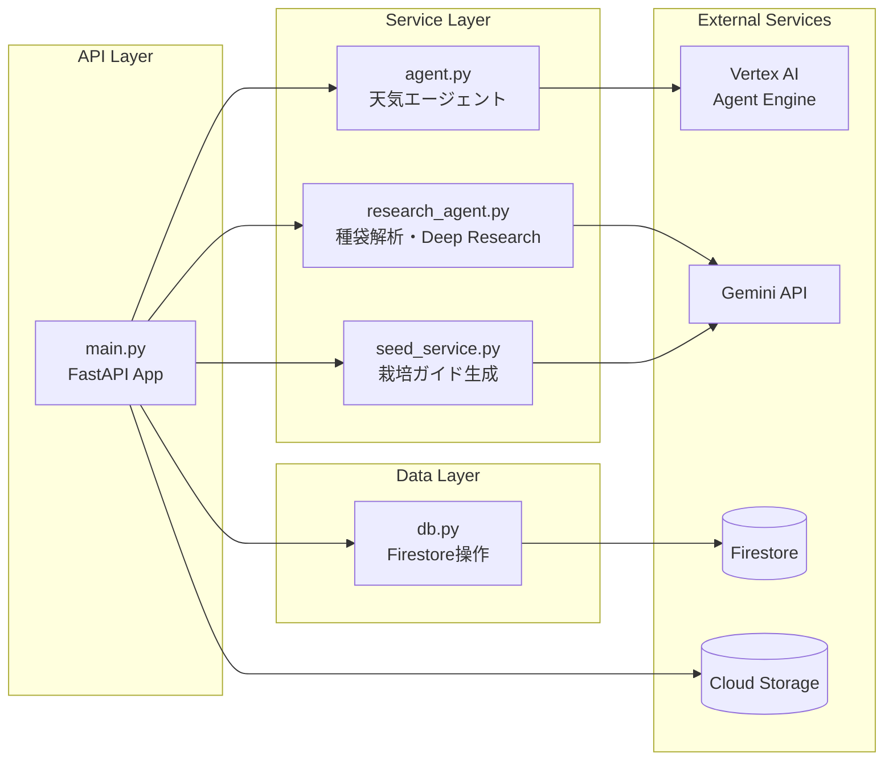
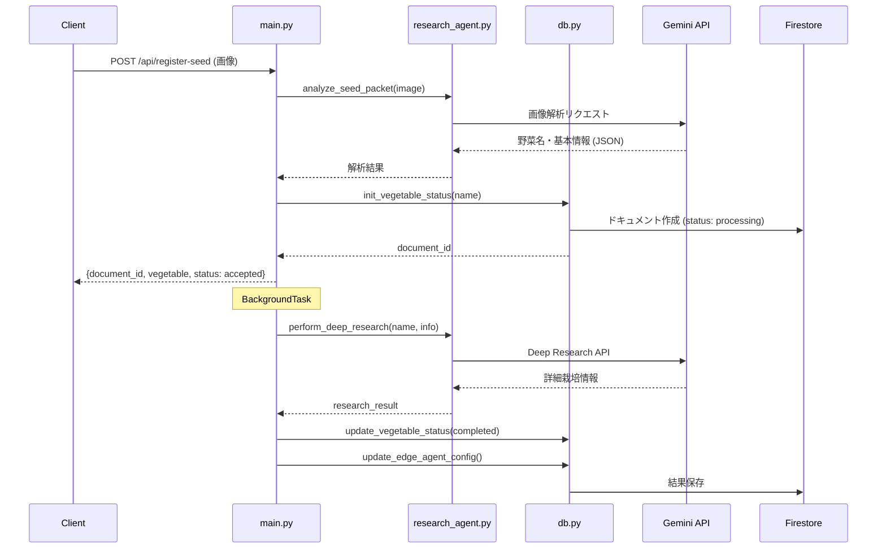
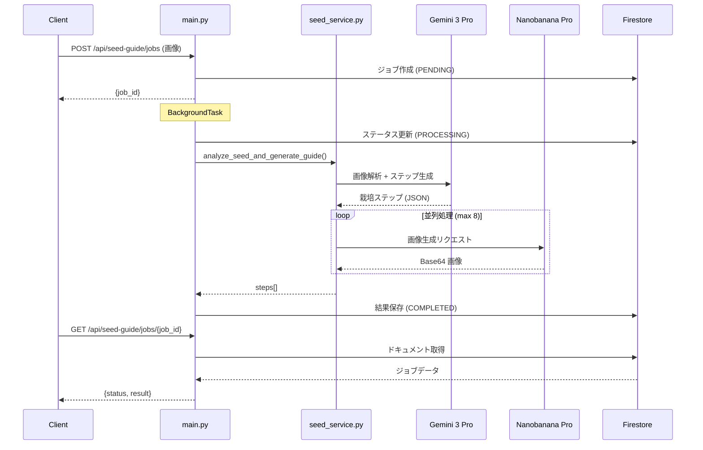

# 🌱 AI Batake App - Backend

FastAPIで構築されたAI Batake Appのバックエンドサーバーです。センサーデータの管理、AI連携、栽培ガイド生成などの機能を提供します。

## 📋 概要

このバックエンドは以下の機能を提供します：

- **センサーデータ管理**: Firestoreからのセンサーデータ取得・履歴管理
- **天気エージェント連携**: Vertex AI Agent Engineを通じた天気情報取得
- **種袋解析**: Gemini APIを使用した種袋画像の解析
- **Deep Research**: AIによる詳細な栽培条件の調査
- **栽培ガイド生成**: 非同期ジョブによるステップバイステップガイドの生成

## 🛠️ 技術スタック

| 技術 | バージョン | 用途 |
|------|----------|------|
| Python | 3.11 | メイン言語 |
| FastAPI | - | Web API フレームワーク |
| Uvicorn | - | ASGI サーバー |
| Google Cloud Firestore | - | NoSQL データベース |
| Google Cloud Storage | - | 画像ストレージ |
| Google Vertex AI | - | AI エージェント基盤 |
| Gemini API | - | 画像解析・Deep Research |
| pytest | 7.4+ | テストフレームワーク |

## 📁 ファイル構成

```
backend/
├── main.py              # FastAPI アプリケーション・APIエンドポイント定義
├── agent.py             # Vertex AI Agent Engine 連携モジュール
├── db.py                # Firestore データベース操作
├── research_agent.py    # 種袋解析・Deep Research ロジック
├── seed_service.py      # 非同期栽培ガイド生成サービス
├── requirements.txt     # Python 依存関係
├── pytest.ini           # pytest 設定
├── tests/               # テストファイル
│   ├── test_main.py     # API エンドポイントテスト
│   ├── test_db.py       # データベース操作テスト
│   ├── test_agent.py    # エージェント連携テスト
│   ├── test_seed_service.py  # 栽培ガイドサービステスト
│   └── test_utils.py    # ユーティリティテスト
└── README.md            # このファイル
```

## 🚀 セットアップ

### 前提条件

- Python 3.11
- Google Cloud アカウント
- 必要な Google Cloud API の有効化:
  - Cloud Firestore API
  - Cloud Storage API
  - Vertex AI API

### 環境変数

```bash
# 必須
export GOOGLE_CLOUD_PROJECT="your-project-id"
export GOOGLE_APPLICATION_CREDENTIALS="/path/to/service-account.json"

# Vertex AI Agent Engine
export AGENT_ENDPOINT="projects/{PROJECT_ID}/locations/us-central1/reasoningEngines/{AGENT_ID}"

# Gemini API (オプション - ADC使用時は不要)
export GEMINI_API_KEY="your-api-key"
export SEED_GUIDE_GEMINI_KEY="your-api-key"
```

### インストール

```bash
cd backend
pip install -r requirements.txt
```

### 起動

```bash
# 開発モード
uvicorn backend.main:app --host 0.0.0.0 --port 8081 --reload

# または直接実行
python -m uvicorn backend.main:app --host 0.0.0.0 --port 8081
```

## 📡 API エンドポイント

### センサー関連

| メソッド | エンドポイント | 説明 |
|---------|---------------|------|
| GET | `/api/sensors/latest` | 最新のセンサーデータを取得 |
| GET | `/api/sensor-history?hours=24` | 指定時間内のセンサー履歴を取得 |

### 天気関連

| メソッド | エンドポイント | 説明 |
|---------|---------------|------|
| POST | `/api/weather` | 指定地域の天気情報を取得 |

**リクエスト例:**
```json
{
  "region": "東京"
}
```

### 野菜・種袋関連

| メソッド | エンドポイント | 説明 |
|---------|---------------|------|
| GET | `/api/vegetables` | 登録された全野菜リストを取得 |
| GET | `/api/vegetables/latest` | 最新の野菜データを取得 |
| POST | `/api/register-seed` | 種袋画像を登録しDeep Researchを開始 |
| GET | `/api/plant-camera/latest` | 最新の植物カメラ画像を取得 |

### 栽培ガイド (非同期ジョブ)

| メソッド | エンドポイント | 説明 |
|---------|---------------|------|
| POST | `/api/seed-guide/jobs` | 栽培ガイド生成ジョブを作成 |
| GET | `/api/seed-guide/jobs/{job_id}` | ジョブのステータスと結果を取得 |

**ジョブステータス:**
- `PENDING`: ジョブ作成済み、処理待ち
- `PROCESSING`: 処理中
- `COMPLETED`: 完了
- `FAILED`: 失敗

## 📊 処理フロー

### モジュール依存関係



### 種袋登録フロー (POST /api/register-seed)



### 栽培ガイド生成フロー (POST /api/seed-guide/jobs)



## 🧪 テスト

### テストの実行

```bash
cd backend
pip install pytest pytest-asyncio httpx
pytest
```

### テストカバレッジ

```bash
pytest --cov=. --cov-report=html
```

### テスト構成

| ファイル | テスト数 | 内容 |
|---------|---------|------|
| test_main.py | 30+ | APIエンドポイントテスト |
| test_db.py | 11 | Firestore操作テスト |
| test_agent.py | 10 | エージェント連携テスト |
| test_seed_service.py | 4 | 栽培ガイドサービステスト |
| test_seed_guide_persistence.py | 4 | 栽培ガイド永続化テスト |
| test_diary_service.py | 10+ | 日記サービステスト |
| test_async_flow.py | 3 | 非同期フローテスト |
| test_select_feature.py | 5 | 野菜選択機能テスト |
| test_logger.py | 5 | ロガーテスト |
| test_utils.py | 4 | ユーティリティテスト |


## 🔒 権限設定

### 必要なIAMロール

- **Vertex AI ユーザー** (`roles/aiplatform.user`): Agent Engine へのアクセス
- **Firestore ユーザー** (`roles/datastore.user`): データベース操作
- **Storage オブジェクト閲覧者** (`roles/storage.objectViewer`): 画像取得

### Cloud Run での設定

Cloud Run サービスアカウントに上記のロールを付与してください。

## ❓ トラブルシューティング

### `403 Forbidden` エラー
権限が不足しています。サービスアカウントに必要なロールが付与されているか確認してください。

### `404 Not Found` エラー (Agent)
`AGENT_ENDPOINT` の値が正しいか確認してください。
- プロジェクトID
- ロケーション (`us-central1` など)
- Reasoning Engine ID

### `ValueError: AGENT_ENDPOINT environment variable is not set`
環境変数が設定されていません。以下を実行してください：
```bash
export AGENT_ENDPOINT="projects/{PROJECT_ID}/locations/us-central1/reasoningEngines/{AGENT_ID}"
```

### Firestore 接続エラー
1. `GOOGLE_APPLICATION_CREDENTIALS` が正しく設定されているか確認
2. `GOOGLE_CLOUD_PROJECT` が設定されているか確認
3. Firestore API が有効になっているか確認

---

問題が解決しない場合は、エラーメッセージを添えて開発者に相談してください！ 🥬
