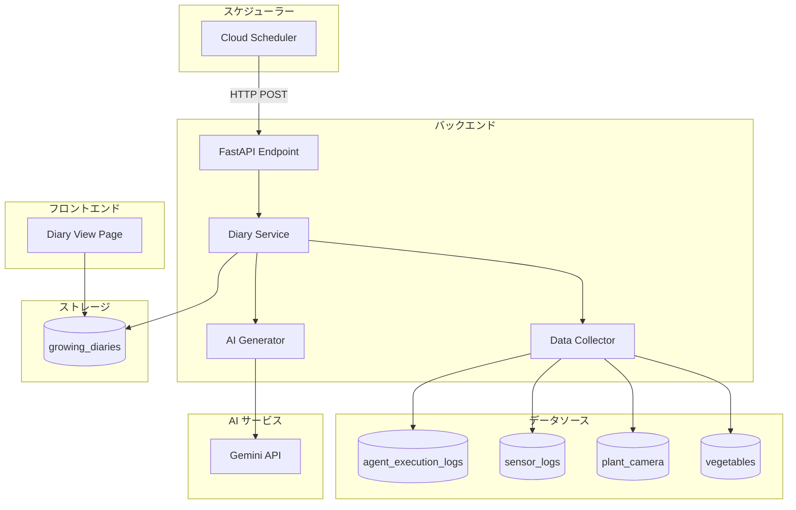

# 育成日記自動生成機能の設計 (Growing Diary Auto-Generation Design)

## 📋 要件定義 (Requirements)

### 機能概要
エッジエージェントのログを毎日解析し、AIを活用して育成日記を自動生成する機能。

### 主要要件
1. **毎日の自動実行**: 指定時刻に自動で日記を生成
2. **ログ解析**: エージェントログとセンサーログを統合分析
3. **AI生成**: Gemini APIを活用して自然な日記文を生成
4. **データ保存**: Firestoreに日記を保存
5. **UI表示**: フロントエンドで日記を閲覧可能

### ユースケース
```
ユーザー → システム自動実行（毎日23:50）
           ↓
        1. 当日のログ収集
           - エージェント実行ログ
           - センサーデータ履歴
           - 植物画像（カメラデータ）
           ↓
        2. AI分析・日記生成
           - ログの要約
           - 異常検知
           - 成長観察
           - 改善提案
           ↓
        3. 保存
           - Firestore: growing_diaries コレクション
           ↓
        4. 通知（オプション）
           - ユーザーへ生成完了通知
```

## 🏗️ システム設計 (System Design)

### 1. アーキテクチャ概要



### 2. データベーススキーマ設計

#### 新コレクション: `growing_diaries`

```typescript
interface GrowingDiary {
  id: string                    // ドキュメントID（例: "2025-02-04"）
  date: string                  // 日付（ISO 8601形式）
  created_at: Timestamp         // 作成日時
  vegetable_id?: string         // 対象野菜のID（現在育成中の野菜）
  vegetable_name?: string       // 野菜名
  
  // 統計情報
  statistics: {
    temperature: {
      min: number
      max: number
      avg: number
    }
    humidity: {
      min: number
      max: number
      avg: number
    }
    soil_moisture: {
      min: number
      max: number
      avg: number
    }
    agent_actions_count: number  // エージェント実行回数
  }
  
  // 主要イベント
  events: Array<{
    time: string                // 時刻
    type: string                // 'action' | 'warning' | 'alert' | 'info'
    device?: string             // デバイス名
    action: string              // アクション内容
    comment?: string            // コメント
  }>
  
  // AI生成コンテンツ
  ai_summary: string            // AIによる1日の要約（200-300文字）
  observations: string          // 成長観察（100-200文字）
  recommendations: string       // 明日への改善提案（100-150文字）
  
  // オプション: 画像
  plant_image_url?: string      // 植物画像のURL
  
  // メタデータ
  generation_status: 'pending' | 'processing' | 'completed' | 'failed'
  generation_time_ms?: number   // 生成にかかった時間（ミリ秒）
  error_message?: string        // エラーメッセージ（失敗時）
}
```

### 3. 実装アプローチ（3つの選択肢）

#### アプローチ A: Cloud Scheduler + HTTP Endpoint（推奨）

**概要**: Google Cloud Schedulerから毎日HTTP POSTリクエストを送信

**メリット**:
- ✅ Google Cloudネイティブ
- ✅ 設定が簡単
- ✅ スケール自動管理
- ✅ Cloud Runとの相性が良い
- ✅ ログ・監視が容易

**デメリット**:
- ⚠️ Cloud Scheduler設定が必要
- ⚠️ 認証設定が必要

**実装方法**:
```bash
# Cloud Scheduler設定コマンド
gcloud scheduler jobs create http daily-diary-generator \
  --schedule="50 23 * * *" \
  --uri="https://ai-batake-app-xxxxx.run.app/api/diary/generate-daily" \
  --http-method=POST \
  --oidc-service-account-email=scheduler@PROJECT_ID.iam.gserviceaccount.com \
  --location=us-central1 \
  --time-zone="Asia/Tokyo"
```

```python
# backend/diary_service.py
@app.post("/api/diary/generate-daily")
async def generate_daily_diary(background_tasks: BackgroundTasks):
    """
    Daily diary generation endpoint.
    Triggered by Cloud Scheduler.
    """
    # Verify request is from Cloud Scheduler
    # (Check OIDC token or IP whitelist)
    
    # Get yesterday's date (since runs at 23:50)
    target_date = (datetime.now() - timedelta(hours=1)).date()
    
    # Queue background task
    background_tasks.add_task(
        process_daily_diary, 
        target_date.isoformat()
    )
    
    return {
        "status": "accepted",
        "date": target_date.isoformat(),
        "message": "Diary generation started"
    }
```

#### アプローチ B: Cloud Functions + Pub/Sub（代替案）

**概要**: Cloud Schedulerがトピックに発行、Cloud Functionsがサブスクライブ

**メリット**:
- ✅ 疎結合アーキテクチャ
- ✅ リトライ機能内蔵
- ✅ イベント駆動

**デメリット**:
- ⚠️ 別サービスの管理が必要
- ⚠️ コールドスタート遅延
- ⚠️ デプロイが複雑化

**実装方法**:
```python
# functions/diary_generator/main.py
import base64
import json
from google.cloud import firestore

def generate_diary(event, context):
    """Cloud Functions entry point"""
    # Decode Pub/Sub message
    if 'data' in event:
        data = json.loads(base64.b64decode(event['data']).decode())
    
    target_date = data.get('date', datetime.now().date().isoformat())
    
    # Call diary generation logic
    result = create_diary_for_date(target_date)
    
    print(f"Diary generated for {target_date}: {result}")
```

#### アプローチ C: FastAPI内蔵スケジューラー（非推奨）

**概要**: APSchedulerなどをFastAPI内で実行

**メリット**:
- ✅ 追加サービス不要
- ✅ デプロイが簡単

**デメリット**:
- ❌ Cloud Runの自動スケールダウンで停止
- ❌ インスタンス複数時に重複実行のリスク
- ❌ ステートフル動作はCloud Runに不適

**非推奨理由**: Cloud Runはステートレスであるべき

### 4. データ収集ロジック

```python
# backend/diary_service.py
from datetime import datetime, timedelta, date
from typing import Dict, List, Any
import logging
from .db import db, get_agent_execution_logs, get_sensor_history

async def collect_daily_data(target_date: date) -> Dict[str, Any]:
    """
    指定日のデータを収集
    """
    # 日付範囲の設定（0:00 - 23:59）
    start_time = datetime.combine(target_date, datetime.min.time())
    end_time = datetime.combine(target_date, datetime.max.time())
    
    # 1. エージェント実行ログを取得
    agent_logs = await get_agent_logs_for_date(start_time, end_time)
    
    # 2. センサーデータを取得
    sensor_data = await get_sensor_data_for_date(start_time, end_time)
    
    # 3. 現在の育成野菜情報を取得
    current_vegetable = await get_current_vegetable()
    
    # 4. 植物画像を取得（最新）
    plant_image = await get_plant_image_for_date(target_date)
    
    return {
        "date": target_date.isoformat(),
        "agent_logs": agent_logs,
        "sensor_data": sensor_data,
        "vegetable": current_vegetable,
        "plant_image": plant_image
    }

async def get_agent_logs_for_date(start: datetime, end: datetime) -> List[Dict]:
    """指定期間のエージェントログ取得"""
    if db is None:
        return []
    
    try:
        docs = db.collection("agent_execution_logs") \
            .where("timestamp", ">=", start.isoformat()) \
            .where("timestamp", "<=", end.isoformat()) \
            .order_by("timestamp") \
            .stream()
        
        logs = []
        for doc in docs:
            log_data = doc.to_dict()
            log_data['id'] = doc.id
            logs.append(log_data)
        
        return logs
    except Exception as e:
        logging.error(f"Error fetching agent logs: {e}")
        return []

async def get_sensor_data_for_date(start: datetime, end: datetime) -> List[Dict]:
    """指定期間のセンサーデータ取得"""
    if db is None:
        return []
    
    try:
        # Unix timestamp for query
        start_unix = int(start.timestamp())
        end_unix = int(end.timestamp())
        
        docs = db.collection("sensor_logs") \
            .where("unix_timestamp", ">=", start_unix) \
            .where("unix_timestamp", "<=", end_unix) \
            .order_by("unix_timestamp") \
            .stream()
        
        data = []
        for doc in docs:
            sensor_log = doc.to_dict()
            sensor_log['id'] = doc.id
            data.append(sensor_log)
        
        return data
    except Exception as e:
        logging.error(f"Error fetching sensor data: {e}")
        return []
```

### 5. 統計計算ロジック

```python
def calculate_statistics(sensor_data: List[Dict]) -> Dict:
    """センサーデータから統計を計算"""
    if not sensor_data:
        return {
            "temperature": {"min": 0, "max": 0, "avg": 0},
            "humidity": {"min": 0, "max": 0, "avg": 0},
            "soil_moisture": {"min": 0, "max": 0, "avg": 0},
        }
    
    temps = [d.get("temperature", 0) for d in sensor_data if d.get("temperature")]
    humids = [d.get("humidity", 0) for d in sensor_data if d.get("humidity")]
    soils = [d.get("soil_moisture", 0) for d in sensor_data if d.get("soil_moisture")]
    
    return {
        "temperature": {
            "min": round(min(temps), 1) if temps else 0,
            "max": round(max(temps), 1) if temps else 0,
            "avg": round(sum(temps) / len(temps), 1) if temps else 0,
        },
        "humidity": {
            "min": round(min(humids), 1) if humids else 0,
            "max": round(max(humids), 1) if humids else 0,
            "avg": round(sum(humids) / len(humids), 1) if humids else 0,
        },
        "soil_moisture": {
            "min": round(min(soils), 1) if soils else 0,
            "max": round(max(soils), 1) if soils else 0,
            "avg": round(sum(soils) / len(soils), 1) if soils else 0,
        },
    }

def extract_key_events(agent_logs: List[Dict], max_events: int = 10) -> List[Dict]:
    """重要なイベントを抽出"""
    events = []
    
    for log in agent_logs:
        log_data = log.get("data", {})
        timestamp = log.get("timestamp", "")
        
        # 操作イベント
        if "operation" in log_data:
            for device, op in log_data["operation"].items():
                action = op.get("action", "")
                # アクティブな操作のみ
                if "ON" in action or "OFF" in action or "起動" in action or "停止" in action:
                    events.append({
                        "time": timestamp,
                        "type": "action",
                        "device": device,
                        "action": action
                    })
        
        # 警告・アラート
        comment = log_data.get("comment", "")
        if "異常" in comment or "エラー" in comment:
            events.append({
                "time": timestamp,
                "type": "alert",
                "action": comment
            })
        elif "警告" in comment or "注意" in comment:
            events.append({
                "time": timestamp,
                "type": "warning",
                "action": comment
            })
    
    # 最大件数まで
    return events[:max_events]
```

### 6. AI日記生成ロジック

```python
# backend/diary_service.py
import os
import requests
import json

async def generate_diary_with_ai(
    date: str,
    statistics: Dict,
    events: List[Dict],
    vegetable_info: Dict
) -> Dict[str, str]:
    """
    Gemini APIを使用して日記を生成
    """
    api_key = os.environ.get("GEMINI_API_KEY") or os.environ.get("SEED_GUIDE_GEMINI_KEY")
    if not api_key:
        raise RuntimeError("Gemini API key not configured")
    
    # プロンプト構築
    prompt = build_diary_prompt(date, statistics, events, vegetable_info)
    
    # Gemini API呼び出し
    url = f"https://generativelanguage.googleapis.com/v1beta/models/gemini-2.0-flash-exp:generateContent?key={api_key}"
    
    payload = {
        "contents": [{
            "parts": [{
                "text": prompt
            }]
        }],
        "generationConfig": {
            "temperature": 0.7,
            "topP": 0.9,
            "maxOutputTokens": 1000
        }
    }
    
    headers = {"Content-Type": "application/json"}
    
    response = requests.post(url, headers=headers, json=payload, timeout=60)
    
    if response.status_code != 200:
        raise RuntimeError(f"Gemini API error: {response.status_code} - {response.text}")
    
    result = response.json()
    generated_text = result["candidates"][0]["content"]["parts"][0]["text"]
    
    # レスポンスをパース
    return parse_diary_response(generated_text)

def build_diary_prompt(
    date: str,
    statistics: Dict,
    events: List[Dict],
    vegetable_info: Dict
) -> str:
    """日記生成用プロンプト構築"""
    
    veg_name = vegetable_info.get("name", "野菜") if vegetable_info else "野菜"
    
    # イベント要約
    event_summary = "\n".join([
        f"- {e['time']}: {e.get('device', '')} {e['action']}"
        for e in events[:10]
    ])
    
    prompt = f"""あなたは植物栽培の専門家です。以下のデータをもとに、育成日記を作成してください。

【日付】
{date}

【育成中の植物】
{veg_name}

【環境データ統計】
温度: 最低 {statistics['temperature']['min']}°C / 最高 {statistics['temperature']['max']}°C / 平均 {statistics['temperature']['avg']}°C
湿度: 最低 {statistics['humidity']['min']}% / 最高 {statistics['humidity']['max']}% / 平均 {statistics['humidity']['avg']}%
土壌水分: 最低 {statistics['soil_moisture']['min']}% / 最高 {statistics['soil_moisture']['max']}% / 平均 {statistics['soil_moisture']['avg']}%

【主要イベント】
{event_summary if event_summary else "特になし"}

以下の3つのセクションに分けて日記を作成してください：

1. **今日の要約** (200-300文字)
   - 1日の環境状態と全体的な様子を要約
   - データから読み取れる特徴的な点を記載

2. **成長観察** (100-200文字)
   - 植物の状態について推測される観察
   - 環境データから判断できる成長の進捗

3. **明日への提案** (100-150文字)
   - データに基づく改善提案
   - 次のステップや注意点

出力フォーマット（必ず以下のJSON形式で返してください）：
```json
{{
  "summary": "今日の要約文...",
  "observations": "成長観察文...",
  "recommendations": "明日への提案文..."
}}
```

日記は親しみやすく、専門的すぎない文体で書いてください。
"""
    
    return prompt

def parse_diary_response(text: str) -> Dict[str, str]:
    """AI応答をパース"""
    try:
        # JSONコードブロックを抽出
        clean_text = text.strip()
        if "```json" in clean_text:
            clean_text = clean_text.split("```json")[1].split("```")[0]
        elif "```" in clean_text:
            clean_text = clean_text.split("```")[1].split("```")[0]
        
        parsed = json.loads(clean_text.strip())
        
        return {
            "summary": parsed.get("summary", ""),
            "observations": parsed.get("observations", ""),
            "recommendations": parsed.get("recommendations", "")
        }
    except Exception as e:
        logging.error(f"Failed to parse AI response: {e}")
        # フォールバック: テキストをそのまま要約として使用
        return {
            "summary": text[:300],
            "observations": "データを分析中です。",
            "recommendations": "引き続き観察を続けます。"
        }
```

### 7. メイン処理フロー

```python
# backend/diary_service.py
async def process_daily_diary(target_date_str: str):
    """
    日記生成のメイン処理
    """
    import time
    start_time = time.time()
    
    try:
        target_date = date.fromisoformat(target_date_str)
        
        # ステータス初期化
        diary_id = target_date_str
        await init_diary_status(diary_id)
        
        # 1. データ収集
        logging.info(f"Collecting data for {target_date_str}...")
        daily_data = await collect_daily_data(target_date)
        
        # 2. 統計計算
        statistics = calculate_statistics(daily_data["sensor_data"])
        events = extract_key_events(daily_data["agent_logs"])
        
        # 3. AI生成
        logging.info(f"Generating diary with AI for {target_date_str}...")
        ai_content = await generate_diary_with_ai(
            target_date_str,
            statistics,
            events,
            daily_data["vegetable"]
        )
        
        # 4. 保存
        generation_time_ms = int((time.time() - start_time) * 1000)
        
        diary_data = {
            "date": target_date_str,
            "created_at": datetime.now(),
            "vegetable_id": daily_data["vegetable"].get("id") if daily_data["vegetable"] else None,
            "vegetable_name": daily_data["vegetable"].get("name") if daily_data["vegetable"] else None,
            "statistics": statistics,
            "events": events,
            "ai_summary": ai_content["summary"],
            "observations": ai_content["observations"],
            "recommendations": ai_content["recommendations"],
            "plant_image_url": daily_data["plant_image"],
            "generation_status": "completed",
            "generation_time_ms": generation_time_ms
        }
        
        await save_diary(diary_id, diary_data)
        
        logging.info(f"Diary generated successfully for {target_date_str} in {generation_time_ms}ms")
        
    except Exception as e:
        logging.error(f"Failed to generate diary for {target_date_str}: {e}")
        await mark_diary_failed(diary_id, str(e))

async def init_diary_status(diary_id: str):
    """日記生成開始"""
    if db is None:
        return
    
    db.collection("growing_diaries").document(diary_id).set({
        "generation_status": "processing",
        "created_at": datetime.now()
    })

async def save_diary(diary_id: str, data: Dict):
    """日記を保存"""
    if db is None:
        logging.warning("DB not available, cannot save diary")
        return
    
    db.collection("growing_diaries").document(diary_id).set(data)
    logging.info(f"Diary saved: {diary_id}")

async def mark_diary_failed(diary_id: str, error: str):
    """失敗マーク"""
    if db is None:
        return
    
    db.collection("growing_diaries").document(diary_id).update({
        "generation_status": "failed",
        "error_message": error,
        "updated_at": datetime.now()
    })
```

## 🎨 フロントエンド設計

### 1. ページ構成

新しいページ: `/diary` または `/growing-diary`

```tsx
// frontend/app/diary/page.tsx
'use client'

import { useState, useEffect } from 'react'
import { Calendar, Sprout, TrendingUp, AlertCircle } from 'lucide-react'

interface GrowingDiary {
  date: string
  vegetable_name?: string
  statistics: {
    temperature: { min: number; max: number; avg: number }
    humidity: { min: number; max: number; avg: number }
    soil_moisture: { min: number; max: number; avg: number }
  }
  ai_summary: string
  observations: string
  recommendations: string
  plant_image_url?: string
}

export default function DiaryPage() {
  const [diaries, setDiaries] = useState<GrowingDiary[]>([])
  const [selectedDate, setSelectedDate] = useState<string | null>(null)
  
  useEffect(() => {
    // Fetch recent diaries
    fetch('/api/diary/list?limit=30')
      .then(res => res.json())
      .then(data => setDiaries(data.diaries || []))
  }, [])
  
  const selectedDiary = diaries.find(d => d.date === selectedDate)
  
  return (
    <div className="container mx-auto p-6">
      <h1 className="text-3xl font-bold mb-6">
        <Sprout className="inline mr-2" />
        育成日記
      </h1>
      
      {/* Calendar/List View */}
      <div className="grid grid-cols-1 lg:grid-cols-3 gap-6">
        {/* Diary List */}
        <div className="lg:col-span-1">
          <DiaryList 
            diaries={diaries} 
            onSelect={setSelectedDate}
            selected={selectedDate}
          />
        </div>
        
        {/* Diary Detail */}
        <div className="lg:col-span-2">
          {selectedDiary ? (
            <DiaryDetail diary={selectedDiary} />
          ) : (
            <EmptyState />
          )}
        </div>
      </div>
    </div>
  )
}
```

### 2. APIエンドポイント

```python
# backend/main.py

@app.get("/api/diary/list")
async def list_diaries(limit: int = 30, offset: int = 0):
    """育成日記一覧取得"""
    if db is None:
        return {"diaries": []}
    
    try:
        docs = db.collection("growing_diaries") \
            .where("generation_status", "==", "completed") \
            .order_by("date", direction=firestore.Query.DESCENDING) \
            .limit(limit) \
            .offset(offset) \
            .stream()
        
        diaries = []
        for doc in docs:
            diary = doc.to_dict()
            diary['id'] = doc.id
            diaries.append(diary)
        
        return {"diaries": diaries}
    except Exception as e:
        logging.error(f"Error fetching diaries: {e}")
        raise HTTPException(status_code=500, detail=str(e))

@app.get("/api/diary/{date}")
async def get_diary(date: str):
    """特定日の日記取得"""
    if db is None:
        raise HTTPException(status_code=503, detail="Database unavailable")
    
    try:
        doc = db.collection("growing_diaries").document(date).get()
        
        if not doc.exists:
            raise HTTPException(status_code=404, detail="Diary not found")
        
        diary = doc.to_dict()
        diary['id'] = doc.id
        return diary
    except HTTPException:
        raise
    except Exception as e:
        logging.error(f"Error fetching diary: {e}")
        raise HTTPException(status_code=500, detail=str(e))

@app.post("/api/diary/generate-daily")
async def generate_daily_diary(background_tasks: BackgroundTasks):
    """
    日次日記生成エンドポイント（Cloud Schedulerから呼び出し）
    """
    # 前日の日記を生成（23:50実行を想定）
    target_date = (datetime.now() - timedelta(hours=1)).date()
    
    background_tasks.add_task(
        process_daily_diary,
        target_date.isoformat()
    )
    
    return {
        "status": "accepted",
        "date": target_date.isoformat(),
        "message": "Diary generation started"
    }

@app.post("/api/diary/generate-manual")
async def generate_manual_diary(
    background_tasks: BackgroundTasks,
    date: str
):
    """
    手動日記生成（テスト・再生成用）
    """
    try:
        # 日付バリデーション
        target_date = date_module.fromisoformat(date)
        
        background_tasks.add_task(
            process_daily_diary,
            date
        )
        
        return {
            "status": "accepted",
            "date": date,
            "message": "Manual diary generation started"
        }
    except ValueError:
        raise HTTPException(status_code=400, detail="Invalid date format")
```

## 🚀 実装ロードマップ

### Phase 1: 基本機能実装（1週間）

- [ ] **Day 1-2**: バックエンド基礎
  - [ ] `diary_service.py` 作成
  - [ ] データ収集関数実装
  - [ ] 統計計算関数実装
  - [ ] Firestore スキーマ作成

- [ ] **Day 3-4**: AI統合
  - [ ] Gemini API連携実装
  - [ ] プロンプトエンジニアリング
  - [ ] レスポンスパース処理
  - [ ] エラーハンドリング

- [ ] **Day 5-6**: API & スケジューラー
  - [ ] APIエンドポイント実装
  - [ ] Cloud Scheduler設定
  - [ ] 認証・セキュリティ
  - [ ] テスト実行

- [ ] **Day 7**: フロントエンド基礎
  - [ ] 日記一覧ページ作成
  - [ ] 日記詳細表示
  - [ ] 基本スタイリング

### Phase 2: UI強化（3-4日）

- [ ] **Day 8-9**: UI/UX改善
  - [ ] カレンダービュー追加
  - [ ] フィルター機能
  - [ ] ソート機能
  - [ ] レスポンシブデザイン

- [ ] **Day 10-11**: 追加機能
  - [ ] 植物画像表示
  - [ ] グラフ表示（統計データ）
  - [ ] エクスポート機能（PDF/CSV）
  - [ ] 検索機能

### Phase 3: 最適化・監視（2-3日）

- [ ] **Day 12-13**: パフォーマンス
  - [ ] キャッシング実装
  - [ ] ページネーション最適化
  - [ ] 画像最適化
  - [ ] レスポンス速度改善

- [ ] **Day 14**: 監視・運用
  - [ ] ログ設定
  - [ ] アラート設定
  - [ ] ダッシュボード作成
  - [ ] ドキュメント整備

## 📊 期待される成果物

1. **バックエンド**
   - `backend/diary_service.py` - 日記生成サービス
   - `backend/main.py` - 新規APIエンドポイント追加
   - `backend/tests/test_diary_service.py` - テストコード

2. **フロントエンド**
   - `frontend/app/diary/page.tsx` - 日記一覧ページ
   - `frontend/components/diary-card.tsx` - 日記カードコンポーネント
   - `frontend/components/diary-detail.tsx` - 詳細表示コンポーネント

3. **インフラ**
   - Cloud Scheduler設定スクリプト
   - デプロイ手順書
   - 運用マニュアル

4. **ドキュメント**
   - API仕様書
   - データベーススキーマ定義
   - ユーザーガイド

## 🔐 セキュリティ考慮事項

1. **Cloud Scheduler認証**
   ```python
   from google.oauth2 import id_token
   from google.auth.transport import requests
   
   def verify_scheduler_request(request: Request):
       """Cloud Schedulerからのリクエストを検証"""
       try:
           # OIDC トークン検証
           token = request.headers.get('Authorization', '').replace('Bearer ', '')
           claim = id_token.verify_oauth2_token(token, requests.Request())
           
           # サービスアカウント確認
           expected_email = "scheduler@PROJECT_ID.iam.gserviceaccount.com"
           if claim.get('email') != expected_email:
               raise HTTPException(status_code=403, detail="Unauthorized")
      MCP -->|Notification| Discord
    
    %% Styling
    classDef default fill:#f9f9f9,stroke:#333,stroke-width:1px;ail="Invalid token")
   ```

2. **レート制限**
   - 手動生成APIに制限を設定（1ユーザーあたり1日10回まで）

3. **データ検証**
   - 日付フォーマットの厳密なバリデーション
   - SQL/NoSQLインジェクション対策

## 💰 コスト見積もり

### 月間コスト概算（1日1回実行）

1. **Cloud Scheduler**: $0.10/月（1ジョブ）
2. **Gemini API**: 約$1-2/月
   - 1リクエスト約1,000トークン × 30日 = 30,000トークン
   - Gemini Flash: $0.00002/1Kトークン
3. **Firestore**:
   - 書き込み: 30回/月 = ほぼ無料
   - 読み取り: 300回/月（推定） = ほぼ無料
4. **Cloud Run**: 増分コストほぼなし（既存実行時間内）

**合計**: 約$1-3/月（非常に低コスト）

## 🎯 成功指標（KPI）

1. **生成成功率**: > 95%
2. **生成時間**: < 30秒/日記
3. **ユーザー閲覧率**: > 50%（生成日記のうち閲覧されるもの）
4. **AI品質スコア**: ユーザーフィードバック 4/5以上

## 📝 今後の拡張アイデア

1. **カスタマイズ機能**
   - ユーザーが日記スタイルを選択（詳細/簡潔）
   - 追記機能（ユーザーが手動でメモ追加）

2. **分析機能**
   - 週次・月次レポート自動生成
   - 成長曲線の可視化
   - 異常検知アラート

3. **共有機能**
   - SNSシェア
   - PDF出力
   - 栽培記録の公開・共有

4. **多言語対応**
   - 英語日記生成オプション
   - 翻訳機能

5. **音声読み上げ**
   - 日記の音声化
   - ポッドキャスト形式でエクスポート

---

**作成日**: 2025-02-04  
**バージョン**: 1.0  
**ステータス**: 設計完了、実装準備完了
