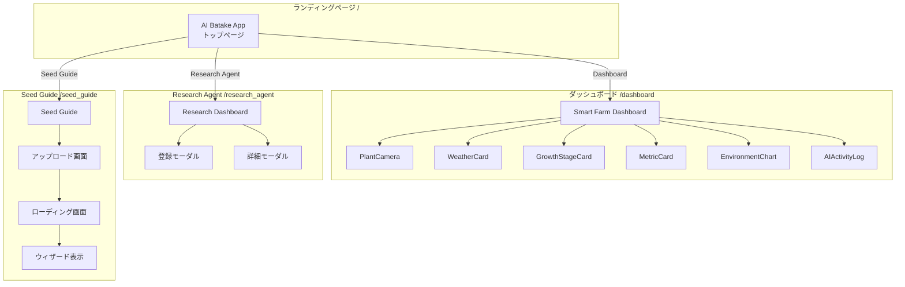
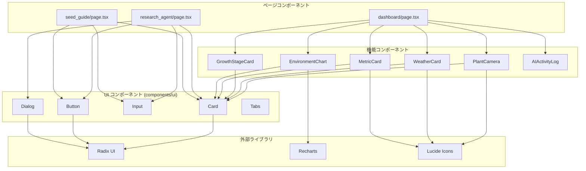

# 🌱 AI Batake App - Frontend

Next.js 16 (App Router) で構築されたAI Batake Appのフロントエンドです。センサーデータの可視化、種袋解析、栽培ガイド生成などのUIを提供します。

## 📋 概要

このフロントエンドは以下の画面を提供します：

- **ランディングページ**: アプリ概要と各機能へのナビゲーション
- **ダッシュボード**: センサーデータ・天気情報・成長段階のリアルタイム表示
- **Research Agent**: 種袋画像のアップロードとDeep Researchの実行
- **Seed Guide**: 非同期ジョブによる栽培ガイドの生成と表示

## 🛠️ 技術スタック

| 技術 | バージョン | 用途 |
|------|----------|------|
| Next.js | 16 | React フレームワーク (App Router) |
| React | 19 | UI ライブラリ |
| TypeScript | 5 | 型安全な開発 |
| Tailwind CSS | 4 | スタイリング |
| Radix UI | - | アクセシブルな UI コンポーネント |
| Recharts | - | データ可視化 (チャート) |
| Lucide React | - | アイコン |
| React Hook Form | - | フォーム管理 |
| Zod | - | バリデーション |
| Jest | 29 | テストフレームワーク |

## 📁 ファイル構成

```
frontend/
├── app/                        # Next.js App Router
│   ├── page.tsx               # ランディングページ
│   ├── layout.tsx             # ルートレイアウト
│   ├── globals.css            # グローバルスタイル
│   ├── dashboard/
│   │   └── page.tsx           # ダッシュボード画面
│   ├── research_agent/
│   │   └── page.tsx           # Research Agent 画面
│   └── seed_guide/
│       └── page.tsx           # Seed Guide 画面
│
├── components/                 # React コンポーネント
│   ├── ui/                    # 基本 UI コンポーネント (Radix UI ベース)
│   ├── metric-card.tsx        # センサーメトリクス表示
│   ├── weather-card.tsx       # 天気情報表示
│   ├── growth-stage-card.tsx  # 成長段階表示
│   ├── environment-chart.tsx  # 環境データチャート
│   ├── plant-camera.tsx       # 植物カメラ画像表示
│   └── ai-activity-log.tsx    # AI アクティビティログ
│
├── lib/                        # ユーティリティ
│   └── utils.ts               # ヘルパー関数 (cn など)
│
├── __tests__/                  # テストファイル
│   ├── components/            # コンポーネントテスト
│   └── lib/                   # ユーティリティテスト
│
├── public/                     # 静的ファイル
├── next.config.mjs            # Next.js 設定
├── tailwind.config.ts         # Tailwind CSS 設定
├── tsconfig.json              # TypeScript 設定
├── jest.config.js             # Jest 設定
├── jest.setup.js              # Jest セットアップ
├── package.json               # 依存関係
└── README.md                  # このファイル
```

## 🚀 セットアップ

### 前提条件

- Node.js 18 以上
- npm または yarn

### インストール

```bash
cd frontend
npm install --legacy-peer-deps
```

### 開発サーバー起動

```bash
npm run dev
```

ブラウザで http://localhost:3000 を開いてください。

### プロダクションビルド

```bash
npm run build
npm start
```

## 📊 画面構成

### ページ遷移フロー



### コンポーネント依存関係



## 📡 API 連携

フロントエンドは Next.js の `rewrites` 機能を使用してバックエンド API にプロキシします。

### next.config.mjs

```javascript
async rewrites() {
  return [
    {
      source: '/api/:path*',
      destination: 'http://localhost:8081/api/:path*',
    },
  ]
}
```

### 使用する API エンドポイント

| 画面 | メソッド | エンドポイント | 用途 |
|------|---------|---------------|------|
| Dashboard | GET | `/api/sensors/latest` | 最新センサーデータ |
| Dashboard | GET | `/api/sensor-history` | センサー履歴 |
| Dashboard | GET | `/api/plant-camera/latest` | 植物カメラ画像 |
| Dashboard | POST | `/api/weather` | 天気情報 |
| Research Agent | GET | `/api/vegetables` | 野菜リスト |
| Research Agent | POST | `/api/register-seed` | 種袋登録 |
| Research Agent | POST | `/api/vegetables/{id}/select` | 指示選択・適用 |
| Seed Guide | POST | `/api/seed-guide/jobs` | ジョブ作成 |
| Seed Guide | GET | `/api/seed-guide/jobs/{id}` | ジョブステータス |

## 🧪 テスト

### テストの実行

```bash
npm test
```

### ウォッチモード

```bash
npm run test:watch
```

### テスト構成

| ファイル | テスト数 | 内容 |
|---------|---------|------|
| lib/utils.test.ts | 7 | ユーティリティ関数テスト |
| components/metric-card.test.tsx | - | MetricCard コンポーネントテスト |
| components/weather-card.test.tsx | - | WeatherCard コンポーネントテスト |
| components/growth-stage-card.test.tsx | - | GrowthStageCard コンポーネントテスト |

## 🎨 スタイリング

### Tailwind CSS 4

このプロジェクトは Tailwind CSS 4 を使用しています。

```css
/* globals.css */
@import "tailwindcss";
```

### カラーテーマ

CSS 変数を使用したテーマシステムを採用しています：

```css
:root {
  --background: 0 0% 100%;
  --foreground: 222.2 84% 4.9%;
  --primary: 142.1 76.2% 36.3%;
  /* ... */
}
```

### コンポーネントスタイル

`class-variance-authority` (CVA) を使用したバリアント管理：

```typescript
const buttonVariants = cva(
  "inline-flex items-center justify-center rounded-md...",
  {
    variants: {
      variant: {
        default: "bg-primary text-primary-foreground...",
        destructive: "bg-destructive text-destructive-foreground...",
      },
      size: {
        default: "h-10 px-4 py-2",
        sm: "h-9 rounded-md px-3",
        lg: "h-11 rounded-md px-8",
      },
    },
  }
)
```

## 📱 レスポンシブデザイン

全画面でレスポンシブデザインに対応しています：

- **モバイル**: 1カラムレイアウト
- **タブレット (md)**: 2カラムレイアウト
- **デスクトップ (lg)**: 3カラムレイアウト

```tsx
<div className="grid grid-cols-1 md:grid-cols-2 lg:grid-cols-3 gap-6">
  {/* カードコンポーネント */}
</div>
```

## 🔧 設定ファイル

### TypeScript (tsconfig.json)

```json
{
  "compilerOptions": {
    "strict": true,
    "paths": {
      "@/*": ["./*"]
    }
  }
}
```

### ESLint

```bash
npm run lint
```

## ❓ トラブルシューティング

### 依存関係のインストールエラー

React 19 との互換性問題がある場合：

```bash
npm install --legacy-peer-deps
```

### API 接続エラー

1. バックエンドが起動しているか確認（ポート 8081）
2. `next.config.mjs` の rewrites 設定を確認
3. CORS 設定を確認

### ビルドエラー

```bash
# キャッシュクリア
rm -rf .next
npm run build
```

---

問題が解決しない場合は、開発者に相談してください！ 🌱
